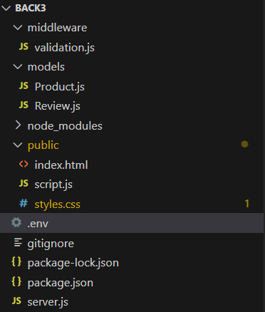
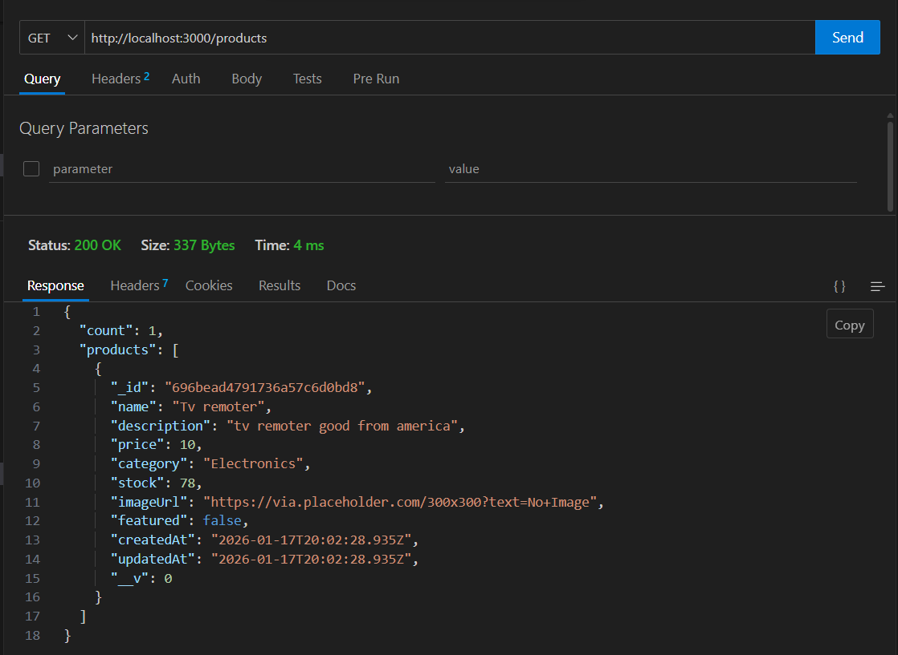
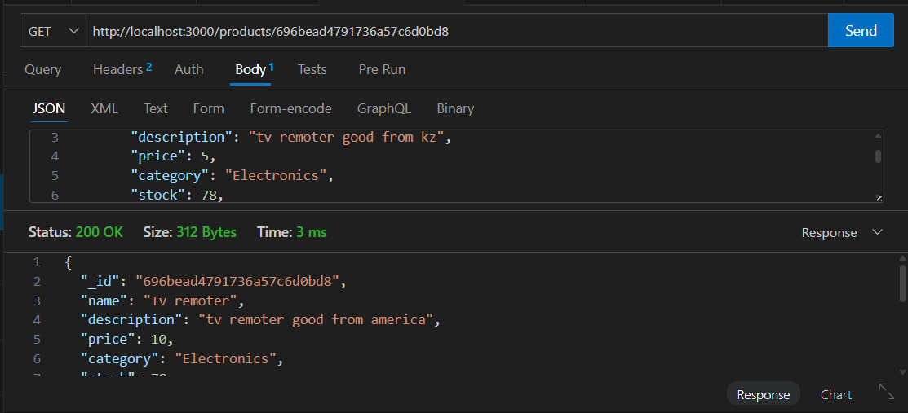
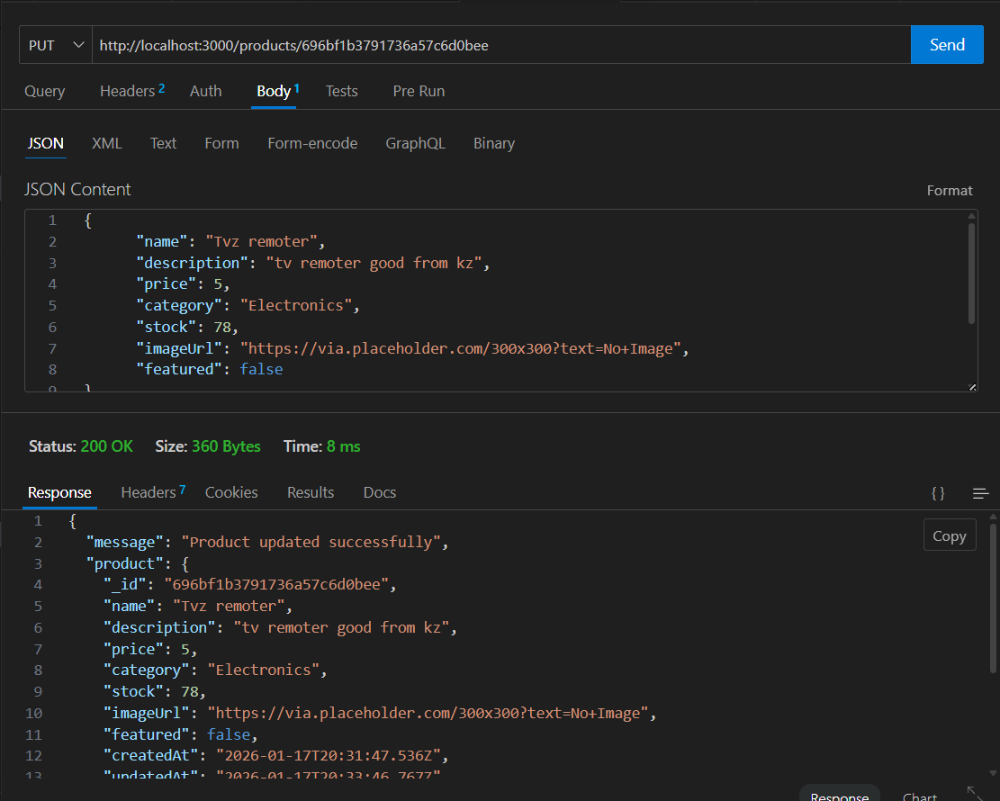
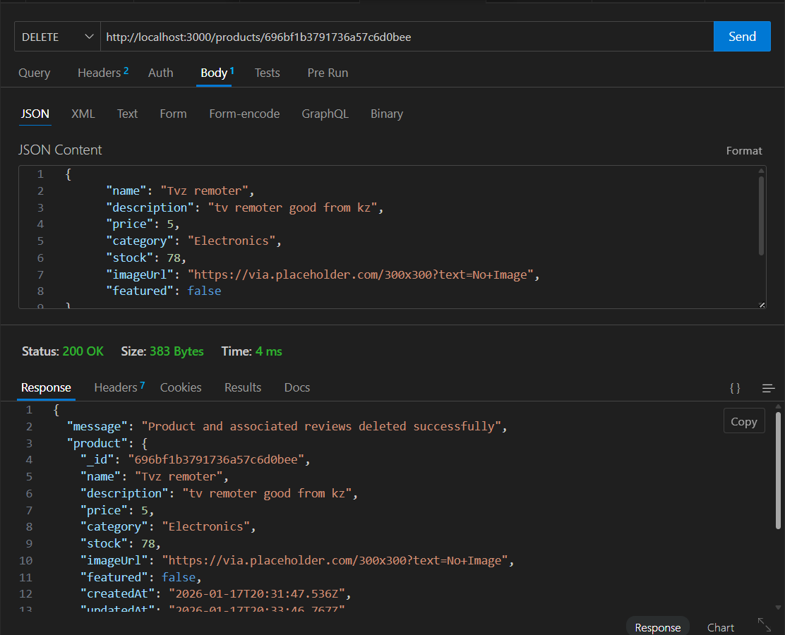

# Assignment 3 - Project Report
## Online Store CRUD API with MongoDB

**Student Name:** Shauzat Sayakhat

---

## Table of Contents
1. Executive Summary
2. Topic Selection & Schema Design
3. Core Functionality Implementation
4. Code Organization & Architecture
5. Frontend Interface
6. Testing & Validation
7. Conclusion
---

## Executive Summary

This project implements a full-stack e-commerce application with complete CRUD (Create, Read, Update, Delete) operations for an online store. The application uses **MongoDB** for data persistence, **Express.js** for the backend API, and vanilla **JavaScript/HTML/CSS** for the frontend interface.

## Topic Selection & Schema Design

### 1.1 Project Topic: Online Store

The chosen topic is an **e-commerce online store** - a platform where users can browse, view, and manage products, as well as read and write product reviews.

**Justification for Topic:**
 Highly relevant to modern web development
 Demonstrates complex data relationships (Products ↔ Reviews)
 Scalable foundation for a complete e-commerce final project
 Real-world applicability with potential for future expansion

### 1.2 Primary Object: Product Schema

The Product schema represents items available for sale in the online store.

**Schema Definition
**Relationship Management:**
- Reviews reference Products via `productId` (ObjectId)
- Mongoose `.populate()` method loads product details with reviews
- Cascade delete: When a product is deleted, all its reviews are also deleted

---

## Core Functionality Implementation

### 2.1 CRUD Operations - Products

All five RESTful operations have been implemented with proper error handling and validation.

#### CREATE - POST /products

**Status Code:** `201 Created`  
**Validation:** Custom middleware + Mongoose schema validation  
**Response:** Returns created product with MongoDB-generated `_id`

#### READ ALL - GET /products
**Status Code:** `200 OK`  
**Features:** Sorted by creation date (newest first)  
**Response:** Array of all products with count

#### READ ONE - GET /products/:id
**Status Codes:** 
 `200 OK` - Product found
 `404 Not Found` - Product doesn't exist
 `400 Bad Request` - Invalid ID format

#### UPDATE - PUT /products/:id
**Status Codes:** `200 OK`, `404 Not Found`, `400 Bad Request`  
**Features:** 
 Returns updated document (`new: true`)
 Runs validation on update (`runValidators: true`)
 Automatically updates `updatedAt` timestamp

#### DELETE - DELETE /products/:id
**Status Codes:** `200 OK`, `404 Not Found`, `400 Bad Request`, `500 Server Error`  
**Features:** Cascade deletion of related reviews

## Code Organization & Architecture

### 3.2 Separation of Concerns

**1. Models Layer (models/)**
 Defines data structure and validation rules
 Encapsulates business logic
 Provides clean interface to database

**2. Middleware Layer (middleware/)**
 Validates incoming requests before they reach route handlers
 Centralizes validation logic (DRY principle)
 Returns consistent error messages

**3. Routes Layer (server.js)**
 Handles HTTP requests and responses
 Coordinates between models and client
 Implements RESTful conventions

**4. Frontend Layer (public/)**
 User interface and interactions
 Communicates with API via fetch()
 Independent from backend implementation

### 3.3 Middleware Implementation

**Validation Middleware (middleware/validation.js):**

**Benefits:**
 Validates data before database operations
 Provides detailed error messages
 Reusable across multiple routes
 Fails fast to prevent invalid data

### 3.4 MongoDB Integration
**Features:**
 Environment-based configuration (.env file)
 Detailed connection logging for debugging
 Error handling with helpful messages
 Automatic reconnection on connection loss

### 3.5 Error Handling Strategy

**Three-Level Error Handling:**

1. **Validation Layer** (Middleware)
    Checks request format and required fields
    Returns `400 Bad Request` with specific errors

2. **Model Layer** (Mongoose)
    Schema validation (types, constraints)
    Returns validation errors with field details

3. **Database Layer** (MongoDB)
    Catches connection errors
    Handles ObjectId casting errors
    Returns appropriate status codes

**Example Error Response:**
```json
{
  "error": "Validation failed",
  "details": [
    "Name is required and must be at least 2 characters long",
    "Price is required and cannot be negative"
  ]
}
```

---

## Frontend Interface

### 4.1 Design Philosophy

The frontend follows a **modern, clean aesthetic** with:
 Light blue (#E8F4FF) and white color scheme
 Smooth animations and transitions
 Responsive grid layout
 Glassmorphism effects
 Floating background elements

### 4.2 User Interface Features

**1. Navigation System**
 Three main views: Products, Add Product, Reviews
 Tab-based navigation with active state indicators
 Smooth view transitions

**2. Products Grid**
- Responsive card layout
- Hover effects with elevation
- Category badges
- Featured product highlights
- Stock level indicators
- Click to view details

**3. Product Details Modal**
- Full product information
- Associated reviews with ratings
- Edit and delete actions
- Image with fallback

**4. Add Product Form**
- All required fields with validation
- Real-time client-side validation
- Category dropdown
- Featured product checkbox
- Success/error feedback messages

**5. Reviews Section**
- List of all product reviews
- Star rating display (1-5 stars)
- User information
- Timestamps
- Product association

### 4.3 Interactive Features

**Search & Filter:**
```javascript
function filterProducts() {
  const category = document.getElementById('category-filter').value;
  const searchTerm = document.getElementById('search-input').value.toLowerCase();
  
  let filtered = allProducts;
  
  if (category) {
    filtered = filtered.filter(p => p.category === category);
  }
  
  if (searchTerm) {
    filtered = filtered.filter(p => 
      p.name.toLowerCase().includes(searchTerm) ||
      p.description.toLowerCase().includes(searchTerm)
    );
  }
  
  displayProducts(filtered);
}
```

**Auto-refresh:**
- Products list refreshes every 30 seconds
- Ensures data stays current
- Non-intrusive background updates

### 4.4 Responsive Design

**Breakpoints:**
 Desktop: 1400px max-width container
 Tablet: Adjusted grid columns
 Mobile: Single column layout, stacked navigation

**Mobile Optimizations:**
- Touch-friendly buttons
- Simplified navigation
- Larger tap targets
- Optimized images

### 4.5 Accessibility Features

 Semantic HTML structure
 ARIA labels where appropriate
 Keyboard navigation support
 Focus indicators
 Alt text for images
 Color contrast compliance

---

## Testing & Validation

### 5.1 Manual Testing with Postman

**Postman Collection Included:** `Postman_Collection.json`

The collection contains test cases for:
- All CRUD operations for Products
- All CRUD operations for Reviews
- Validation error scenarios
- Invalid ID formats
- Non-existent resources

**Sample Test Cases:**

| Test Case | Method | Expected Result |
| Create valid product | POST /products | 201 Created + product object |
| Create invalid product | POST /products | 400 Bad Request + error details |
| Get all products | GET /products | 200 OK + products array |
| Get non-existent product | GET /products/[fake-id] | 404 Not Found |
| Update product | PUT /products/:id | 200 OK + updated product |
| Delete product | DELETE /products/:id | 200 OK + cascade delete reviews |

## Conclusion

In this assignment, I developed a backend for an online store using Express and MongoDB. The project was migrated from a local JSON storage to a MongoDB database with Mongoose for data modeling and validation. A full CRUD API was implemented, allowing users to create, read, update, and delete products. Additionally, a simple front-end interface was created to demonstrate interaction with the API and data persistence.

